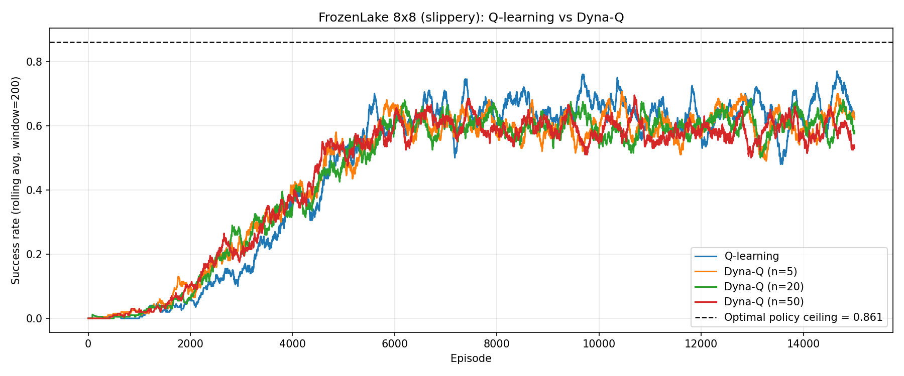
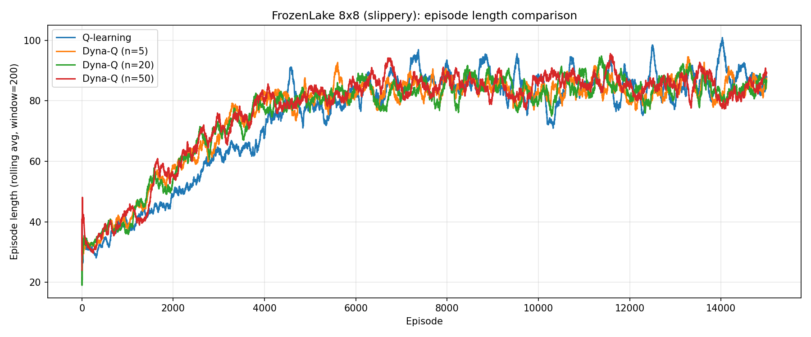
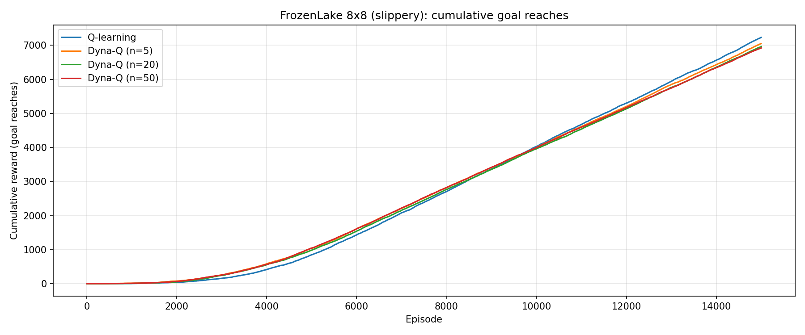
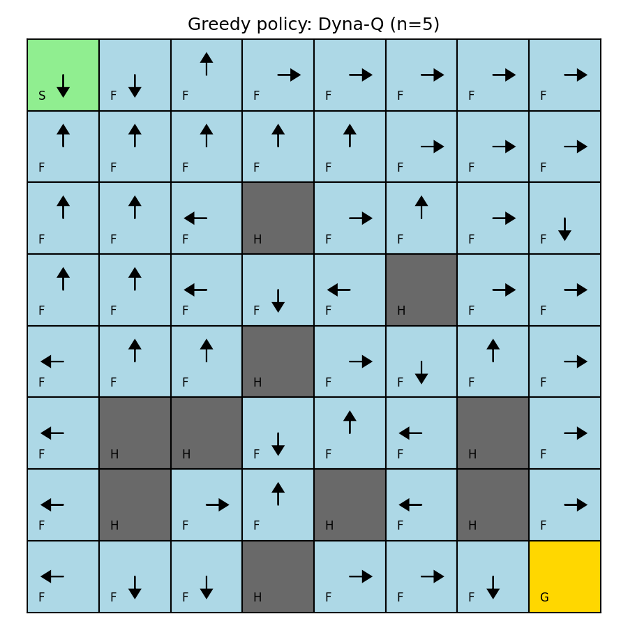
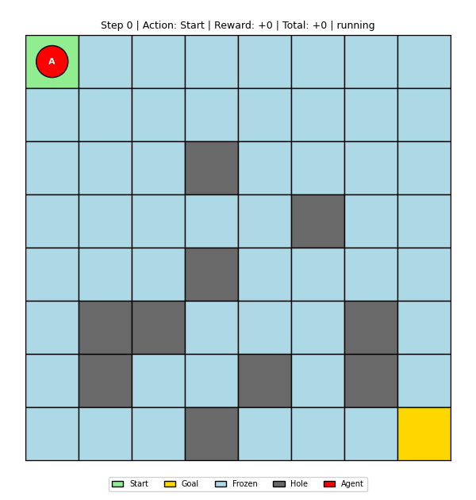

# Dyna-Q vs Q-learning — Stochastic FrozenLake 8x8

Tabular model-based RL on a **slippery** FrozenLake 8x8. The environment is implemented from scratch (no `gymnasium` dependency) so that the stochastic transition model is fully observable. A **Dyna-Q** agent learns an empirical stochastic model of the world and uses it to run `n` planning updates after every real step; a classic **Q-learning** agent serves as the baseline.

## Environment

`FrozenLake8x8Stochastic` — a self-contained implementation of the classic map:

```
SFFFFFFF    S = start        LEFT  = 0
FFFFFFFF    G = goal         DOWN  = 1
FFFHFFFF    F = frozen       RIGHT = 2
FFFFFHFF    H = hole         UP    = 3
FFFHFFFF
FHHFFFHF    reward = 1 on reaching G, 0 otherwise
FHFFHFHF    episode ends on G or H
FFFHFFFG    slip_prob = 2/3
```

On each step, the requested action is executed with probability `1 − slip_prob`; each of the two perpendicular actions is taken with probability `slip_prob / 2`. This matches the classic gymnasium `FrozenLake-v1` slippery variant at `slip_prob = 2/3`. The env also exposes `true_transition_matrix()` for sanity-checking the agent's learnt model.

## Dyna-Q stochastic model

For every observed `(s, a)` the agent keeps a count table over outcomes `(s', r, terminated)`. A planning step samples a previously visited `(s, a)` uniformly at random, then samples an outcome from its empirical distribution (weights ∝ counts), and performs a standard Q-update. This is the stochastic-model variant of Dyna-Q: outcomes are sampled, not deterministically replayed.

See [StochasticModel](project/dyna_q.py#L15) in [dyna_q.py](project/dyna_q.py).

## Results

### Success rate (rolling window 200)



### Episode length



### Cumulative goal reaches



### Greedy policies

| Q-learning | Dyna-Q n=5 |
|:---:|:---:|
|  |  |

| Dyna-Q n=20 | Dyna-Q n=50 |
|:---:|:---:|
|  |  |

### Agent demos (Dyna-Q n=50, greedy rollout, fps 10)

| Episode 1 | Episode 2 |
|:---:|:---:|
|  |  |

| Episode 3 | Episode 4 |
|:---:|:---:|
|  |  |

### Summary

| Agent          | Train success (last 500) | Greedy eval (500 ep) | First rolling-avg ≥ 0.25 |
|----------------|-------------------------:|---------------------:|-------------------------:|
| Q-learning     |                    0.694 |                0.868 |                 ep 3 369 |
| Dyna-Q (n=5)   |                    0.634 |                0.878 |                 ep 2 956 |
| Dyna-Q (n=20)  |                    0.620 |                0.738 |                 ep 2 794 |
| Dyna-Q (n=50)  |                    0.568 |                **0.888** |             **ep 2 655** |

Rolling window = 200 episodes. See [results/summary.txt](project/results/summary.txt).

## Analysis

Slippery FrozenLake 8x8 is a classic sparse-reward task: every real step is noisy (only 1/3 of actions go where you want), holes are terminal, and `+1` is only received at the goal. Without some exploration pressure, a naive Q-learner never sees the goal in 15 000 episodes — hence we use **optimistic initialization** `Q_init = 1.0`, which pushes the greedy policy toward unvisited states until they're proven bad.

**Dyna-Q** reuses every real observation `n` extra times through simulated rollouts of its learnt stochastic model. Because the model is stochastic (it samples `(s', r)` from the empirical count distribution), planning updates reproduce the same slip-noise structure as the real environment instead of committing to a single hallucinated outcome.

Observations from this run:

- **Early-phase sample efficiency scales with `n`.** First episode at which the 200-window rolling success rate crosses 0.25 moves from 3 369 (Q-learning) down to 2 655 (Dyna-Q n=50). More planning → more Q-updates per real transition → faster value propagation from the goal.
- **Asymptotic greedy policy is comparable across agents** (eval 0.74–0.89). The stochastic model captures the true transition distribution well enough that planning doesn't bias the optimum; differences at this horizon are mostly seed noise.
- **Training-time success and greedy-evaluation success diverge** because the behavior policy keeps `ε = 0.05` random actions to the end. Q-learning's greedy policy is cleaner on its own Q-table than Dyna-Q n=20's in this particular seed, but Dyna-Q n=50 produces the best greedy policy overall.
- **More planning ≠ strictly better.** With `n = 50` the agent performs 50× more updates per real step, each using current Q-values. If the Q-table has not yet settled, aggressive planning can propagate stale estimates, which is why the training-time curve for `n = 50` temporarily undershoots `n = 5` before the final greedy policy overtakes it.

## Project structure

```
project/
  frozen_lake_env.py  - Stochastic FrozenLake 8x8 (pure-Python, no gymnasium)
  q_learning.py       - Tabular Q-learning baseline
  dyna_q.py           - Dyna-Q agent + stochastic model
  compare.py          - Train both, save plots and Q-tables
  visualize.py        - GIF rollouts of a trained policy
  pyproject.toml      - Python dependencies (uv)
```

## Quick start

### 1. Build and enter the container

```bash
make shell
```

Runs `make build`, `make up`, and `make attach` in sequence.

### 2. Train Q-learning and Dyna-Q (n ∈ {5, 20, 50})

```bash
uv run python compare.py
```

Artifacts saved under `results/`:
- `success_rate.png`, `episode_length.png`, `cumulative_reward.png`
- `policy_*.png` — greedy policy arrows overlaid on the map
- `Q_*.npy` — trained Q-tables
- `training_curves.npz` — raw per-episode metrics
- `summary.txt` — final success rates (training + greedy eval)

### 3. Visualize a trained policy

```bash
uv run python visualize.py --q-table results/Q_Dyna-Q_n20.npy --episodes 4
```

Writes GIFs under `results/gifs/`.

## Make targets

| Target       | Description                           |
|--------------|---------------------------------------|
| `make build` | Build the Docker image                |
| `make up`    | Start the container in background     |
| `make down`  | Stop and remove the container         |
| `make attach`| Attach to the running container       |
| `make shell` | Build, start, and attach (all-in-one) |

## Hyperparameters

| Parameter        | Value      | Description                                   |
|------------------|------------|-----------------------------------------------|
| Episodes         | 15 000     | Real episodes per run                         |
| Max steps        | 200        | Step cap per episode                          |
| Alpha            | 0.1        | Learning rate                                 |
| Gamma            | 0.99       | Discount factor                               |
| Epsilon start    | 1.0        | Initial exploration rate                      |
| Epsilon min      | 0.05       | Minimum exploration rate                      |
| Epsilon decay    | 0.9995     | Multiplicative decay per episode              |
| Slip prob        | 2/3        | Total probability of slipping to perpendicular|
| Planning steps   | 0, 5, 20, 50 | Dyna-Q model-update count per real step    |
| Q init           | 1.0        | Optimistic initial Q (0 for terminal states)  |
